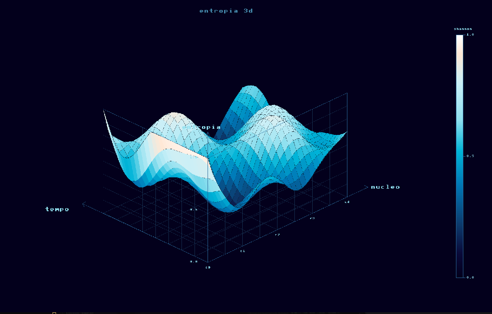

# entropia3d



Projeto de estudo sobre assembly x86-64 e teoria da informação aplicada a métricas de CPU em tempo real.

O objetivo foi entender como instruções como `CPUID`, `RDTSC` e `RDMSR` funcionam diretamente no hardware, e usar os dados coletados para calcular entropia de Shannon sobre contadores de performance, visualizando o resultado em 3D.

---

## o que faz

- Lê contadores de hardware via `RDMSR` (instruções retiradas, cache misses L1/L2, branch mispredictions, ciclos de stall)
- Usa `CPUID` em assembly puro para detectar topologia, frequências, cache e features ISA do processador
- Calcula entropia de Shannon normalizada sobre as distribuições dos contadores por núcleo
- Renderiza uma superfície 3D animada com colormap oceano mostrando a entropia por núcleo ao longo do tempo
- Exporta os dados para um visualizador Python com gráficos de histórico, IPC e métricas por núcleo

---

## arquitetura

```
entropia3d/
├── asm/
│   └── cpuid_asm.asm        # CPUID, RDTSC, RDMSR em assembly x86-64 puro
├── include/                 # headers de todos os módulos
├── src/
│   ├── coletor_cpu.c        # coleta de amostras via MSR por núcleo
│   ├── calculador_entropia.c# cálculo de entropia de Shannon normalizada
│   ├── renderizador_3d.c    # renderizador software com projeção ortográfica
│   ├── gerenciador_interacao.c # câmera, ray cast, eventos de teclado e mouse
│   ├── serializador_snapshot.c # serialização binária com CRC32 IEEE
│   ├── buffer_log.c         # buffer circular de log sem alocação dinâmica
│   ├── micro_kernel.c       # loop principal, sincronização lock-free via versão
│   └── visualizador_sdl.c   # frontend SDL2
├── visualizador_entropia.py # visualizador Python com matplotlib
└── iniciar.sh               # inicia o kernel C e o visualizador juntos
```

---

## dependencias

- `gcc` com suporte a C11
- `nasm` para montar o módulo assembly
- `SDL2` para o frontend gráfico
- `python3` com `numpy`, `matplotlib` e `scipy` para o visualizador externo

Em sistemas Debian/Ubuntu:

```bash
sudo apt install gcc nasm libsdl2-dev python3-numpy python3-matplotlib python3-scipy
```

---

## compilar e executar

```bash
# compilar
make

# executar apenas o visualizador C com SDL2
./entropia3d

# executar kernel C + visualizador Python juntos
./iniciar.sh
```

---

## como funciona a entropia

Para cada núcleo físico, o coletor acumula amostras dos contadores de hardware em um buffer circular. A cada ciclo de coleta, os valores de cada métrica (ciclos, instruções, cache misses, branch mispredictions, stalls) são distribuídos em 16 bins e a entropia de Shannon é calculada:

```
H = -sum(p_i * log2(p_i))
```

O resultado é normalizado para o intervalo [0, 1] dividindo por log2(16). Um valor próximo de 0 indica comportamento determinístico e previsível. Um valor próximo de 1 indica alta variabilidade nos contadores, o que geralmente corresponde a carga de trabalho irregular ou pressão de cache.

---

## modo degradado

Se o processador não expor contadores programáveis via `CPUID leaf 0Ah`, o sistema entra em modo degradado e opera apenas com os contadores fixos disponíveis. O log registra o evento e a coleta continua com dados parciais.

---

## serializacao de snapshots

O estado completo da grade de entropia pode ser salvo e restaurado em formato binário próprio com cabeçalho mágico e checksum CRC32 IEEE. Tecla `S` salva, tecla `L` restaura.

---

## controles SDL2

| tecla / ação       | efeito                        |
|--------------------|-------------------------------|
| arrastar mouse     | rotacionar câmera             |
| scroll             | zoom                          |
| setas              | translação                    |
| `R`                | reset de câmera               |
| `F`                | focar no minitop selecionado  |
| `S`                | salvar snapshot               |
| `L`                | carregar snapshot             |
| `D`                | sobrepor log na tela          |
| `ESC`              | sair                          |

---

## notas de estudo

Este projeto foi desenvolvido durante o estudo de assembly x86-64 e teoria da informação. O foco foi entender o funcionamento real das instruções privilegiadas e como os contadores de hardware refletem o comportamento interno do processador, sem depender de bibliotecas de profiling externas como `perf` ou `PMU tools`.

A implementação do `CPUID` em assembly puro (sem `cpuid.h`) foi especialmente útil para entender o modelo de folhas e subfolhas da instrução e como a topologia de cache é exposta pelo processador.
